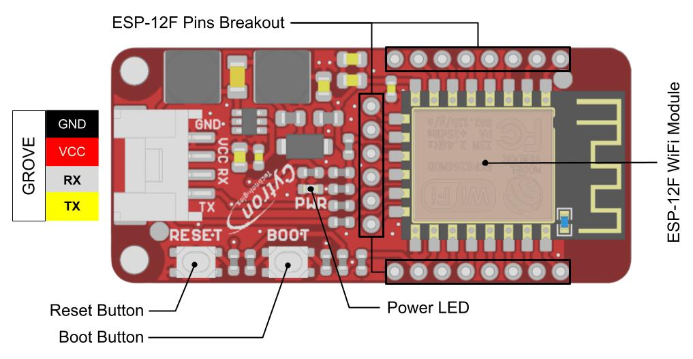

> Diese Seite bei [https://elssner.github.io/mqtt/](https://elssner.github.io/mqtt/) öffnen

[Grove WiFi 8266 - IoT for micro:bit and beyond](https://www.cytron.io/p-grove-wifi-8266-iot-for-microbit-and-beyond)

### Features

* Based on ESP-12F (ESP8266 MCU) WiFi module
* Serial UART Interface (Baud rate: 115200bps)
* ESP-AT (AT command) firmware v2.2.0
* Grove 4-pin connector (Rx, Tx, Vcc ,Gnd)
* Onboard Reset & Boot switch
* Built-in power LED
* All the pins of the ESP-12F are extended out with clear labels
* 3V - 6V supply input voltage
* 32Mbit built-in SPI Flash
* 802.11 b/g/n protocol (2.4GHz)
* MakeCode extension provided
* CircuitPython libraries provided

### Resources

Grove WiFi 8266 datasheet
Getting started tutorial (micro:bit)
MakeCode extension for micro:bit
CircuitPython libraries for Raspberry Pi Pico & RP2040
Cytron custom compiled ESP-AT firmware
How to update ESP-AT firmware
Espressif ESP-AT commands user guide
Grove WiFi 8266 CAD files

## [RobotShop](https://eu.robotshop.com/de/products/grove-wifi-8266-iot-microbit-beyond)

### Beschreibung

* Grove WiFi 8266 IoT für micro:bit & Beyond
* Entwickelt für micro:bit (Nicht enthalten)
* Kommt vorinstalliert mit der neuen Espressif ESP-AT Firmware v2.2.0
* Onboard-Reset und Boot-Schalter
* Eingebaute Power-LED
* Versorgungseingangsspannung: 3 - 6 V

Das Grove WiFi 8266 IoT für micro:bit & Beyond wurde entwickelt, um es Ihrem micro:bit (und auch anderen Controllern) zu ermöglichen, Daten über das Internet über das Wi-Fi-Netzwerk zu senden/zu empfangen. Es basiert auf dem ESP-12F-Modul des Ai-Thinker und wird mit der neuen Espressif ESP-AT-Firmware v2.2.0 vorinstalliert.

## Als Erweiterung verwenden

Dieses Repository kann als **Erweiterung** in MakeCode hinzugefügt werden.

* öffne [https://makecode.calliope.cc/](https://makecode.calliope.cc/)
* klicke auf **Neues Projekt**
* klicke auf **Erweiterungen** unter dem Zahnrad-Menü
* nach **https://github.com/elssner/mqtt** suchen und importieren

## Dieses Projekt bearbeiten 

Um dieses Repository in MakeCode zu bearbeiten.

* öffne [https://makecode.calliope.cc/](https://makecode.calliope.cc/)
* klicke auf **Importieren** und dann auf **Importiere URL**
* füge **https://github.com/elssner/mqtt** ein und klicke auf Importieren

## Blocks preview

This image shows the blocks code from the last commit in master.
This image may take a few minutes to refresh.

#### Metadaten (verwendet für Suche, Rendering)

* for PXT/calliopemini

> Diese Seite bei [https://elssner.github.io/mqtt-fernbedienung-73/](https://elssner.github.io/mqtt-fernbedienung-73/) öffnen

## Als Erweiterung verwenden

Dieses Repository kann als **Erweiterung** in MakeCode hinzugefügt werden.

* öffne [https://makecode.calliope.cc/](https://makecode.calliope.cc/)
* klicke auf **Neues Projekt**
* klicke auf **Erweiterungen** unter dem Zahnrad-Menü
* nach **https://github.com/elssner/mqtt-fernbedienung-73** suchen und importieren

## Dieses Projekt bearbeiten

Um dieses Repository in MakeCode zu bearbeiten.

* öffne [https://makecode.calliope.cc/](https://makecode.calliope.cc/)
* klicke auf **Importieren** und dann auf **Importiere URL**
* füge **https://github.com/elssner/mqtt-fernbedienung-73** ein und klicke auf Importieren

#### Metadaten (verwendet für Suche, Rendering)

* for PXT/calliopemini

